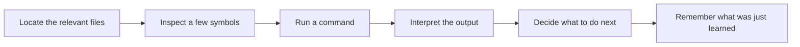
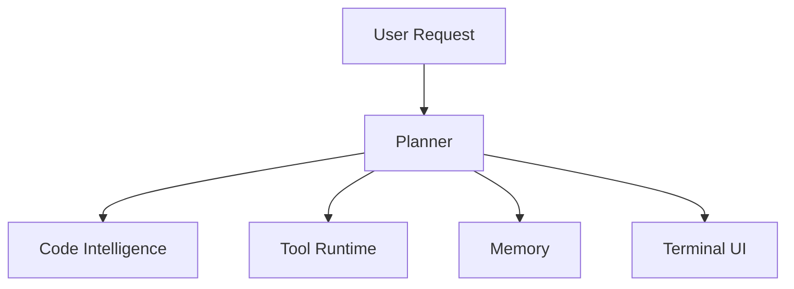
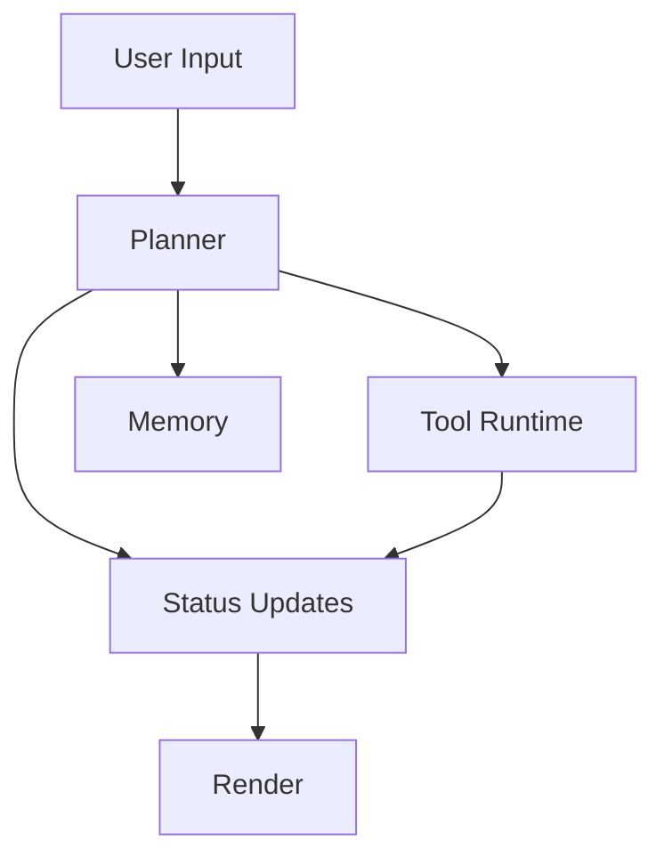
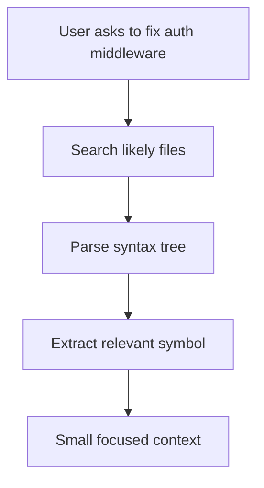
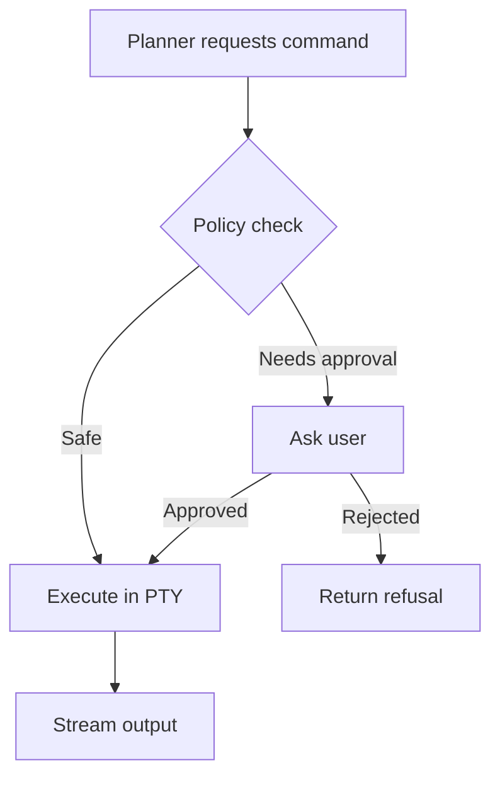
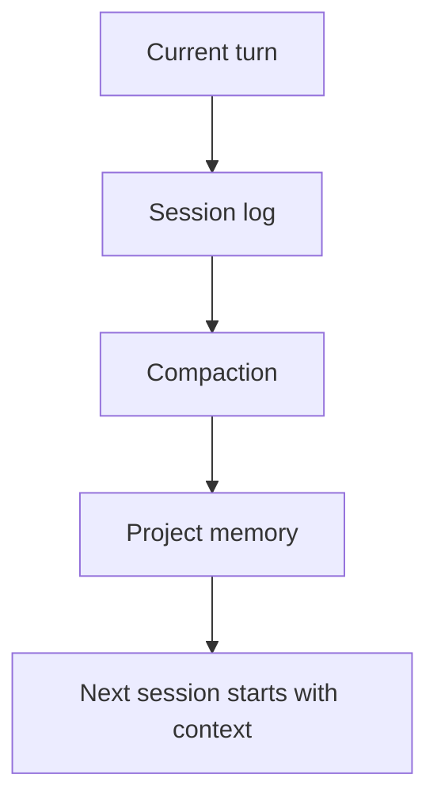
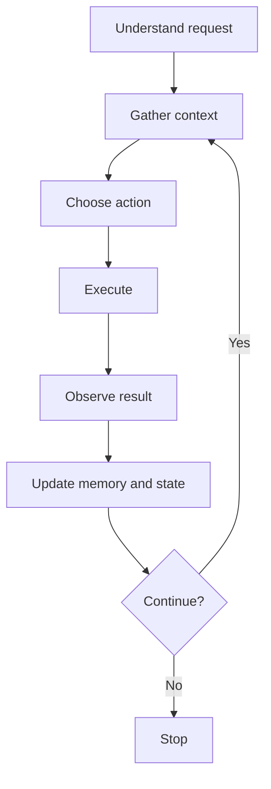

# Article 1: Foundations — What a Coding Agent Actually Needs

When I first got into AI, I built Craftydraft, an automatic article generator. You gave it a topic, the AI wrote an article, then it waited. That was the whole loop: prompt in, text out, human back in the driver's seat.

It died. The output was not bad, but it could not keep going in the agent economy. Every turn reset to zero. It had no memory of what it had tried, no way to notice when something failed, and no mechanism for doing the next logical thing without being explicitly asked. It was a wrapper.

We are not building a wrapper.

An agent is something different: a system that can inspect a repository, choose the next action, run tools, observe results, and maintain enough state to continue without restarting from scratch on every turn.

That is what this series builds.

An open-source CLI agent, codename **ProjectKitty**, designed to be logical, fast, safe, and practical for real software work. We are using **Go** for the runtime and **Bubble Tea** for the terminal UI. The bigger point is architectural: clear boundaries between planning, code intelligence, execution, memory, and presentation.

By the end of the series, we will have a working CLI agent that can:

- inspect code semantically instead of reading files blindly
- execute terminal actions with guardrails
- persist project memory across sessions
- stream its state through a responsive terminal UI

## Best Practices Before We Start

We keep planning, execution, memory, and rendering as separate concerns. **ReAct** supports interleaving reasoning and action instead of treating tool use as a separate afterthought.

We prefer typed tools over free-form shell behavior. **Toolformer** supports exposing tools through explicit call boundaries with defined inputs and outputs.

We treat safety policy as part of the runtime, not as prompt text. **SWE-agent** supports the idea that interface design strongly affects agent performance in software engineering tasks.

We keep both human-readable memory and structured operational state, and we make extensibility plug into the same tool model instead of bypassing it.

## 1. The Agentic Loop

Real coding work follows a pattern that wrappers cannot handle:

1. locate the relevant files
2. inspect a few symbols
3. run a command
4. interpret the output
5. decide what to do next
6. remember what was just learned

An agent manages the full sequence as a system. That is not just a matter of "more intelligence." It is a matter of tighter control over state, tools, and iteration. The intelligence is almost secondary. The loop is the product.

## 2. The Five Subsystems

If we want this project to stay understandable as it grows, the architecture has to be split into clear parts.

### Planner

The planner decides what should happen next. It does not edit files or run commands directly. It produces the next action based on the current user request, recent observations, and remembered project context.

### Code Intelligence

The code intelligence layer answers questions like:

- where is the relevant symbol
- what function or class should be extracted
- what files are probably related

This layer exists so the planner does not have to dump entire files into the model every time it needs context.

### Tool Runtime

The runtime executes actions in the local environment: shell commands, file reads, edits, tests, and any external tools we expose later. It is responsible for safety, process handling, output capture, and cancellation.

This is consistent with both Claude Code and Codex: the best systems expose a runtime with explicit tool types, execution boundaries, and policy checks.

### Memory

The agent needs both short-term and long-term memory. Short-term memory tracks the current turn and recent tool results. Long-term memory stores durable project facts, decisions, and checkpoints that should survive across sessions.

That split is directly supported by the research. Claude Code combines JSONL session history, persistent project memory, and indexed metadata, while Codex points toward a structured state database for resumable work and cross-session tracking.

### Terminal UI

The UI is not decoration. It is how the system explains what it is doing, what it is waiting on, and where it is blocked. If the interface lags or hides state, the whole agent feels unreliable.

One important design implication from the Codex research is that these parts should communicate through clear message boundaries. Whether that becomes channels inside one process or IPC between multiple processes later, the architecture should assume that planning, execution, and rendering are decoupled systems.

## 3. Choosing the Stack: Go + Bubble Tea

We are choosing **Go** because it is a strong fit for a terminal-first agent:

- it compiles to a single binary
- it handles concurrency well
- it works cleanly across macOS, Linux, and Windows
- it is well suited to process management, streams, and local tooling

We are choosing **Bubble Tea** because the agent is naturally event-driven. Tool starts, tool output, user input, cancellations, progress updates, and completion states all map well to a message-based UI loop.

That separation matters. The planner and runtime should keep working even if the screen is redrawn a hundred times per second. Bubble Tea gives us a clean way to keep rendering responsive while background work continues elsewhere.

For the first implementation, we can keep this inside one Go application. But the architecture should still leave room for a future split between UI and agent runtime if we need stronger isolation, background execution, or remote control later.

## 4. Reading Code Without Reading Everything

A coding agent that only reads raw files is noisy, expensive, and slow. If the user says "fix the auth middleware," the agent should not need to read every line of every authentication-related file just to find the right function.

The better approach is local code intelligence:

- fast text search to find candidate files
- syntax-aware parsing to identify functions, classes, methods, and blocks
- targeted extraction of the smallest useful code region

This is where tools like **Tree-sitter** matter. They let us ask structural questions about code instead of relying only on line ranges and keyword matches.

That does not make the agent "smart" by itself. It makes the context pipeline efficient. The model sees less noise and more of the code that actually matters.

## 5. Why Safe Execution Matters

Reading code is only half the system. A useful agent also needs to act: run tests, inspect logs, list files, invoke package managers, and eventually edit code.

That immediately raises two engineering problems:

- terminal programs are messy
- unrestricted execution is dangerous

Terminal programs are messy because many developer tools expect a real terminal, not a bare subprocess pipe. They emit ANSI sequences, ask interactive questions, and behave differently depending on terminal size and capabilities.

Execution is dangerous because an agent should not be able to treat every shell command as equally safe. The runtime needs explicit guardrails around risky operations, clear visibility into what is being executed, and predictable cancellation behavior.

A serious agent needs policy as a first-class concept:

- different approval modes for different environments
- sandboxed and non-sandboxed execution paths
- runtime flags for destructive behavior and expanded access
- a clear record of what policy was active when a command ran

We will handle those concerns later in the series with a PTY-backed runtime and a permission model. For now, the foundation is simple: execution belongs in a controlled subsystem, not mixed into ad hoc prompt logic.

## 6. Memory, or Why Every Turn Shouldn't Feel Like the First

Without memory, every turn becomes a partial restart. The agent asks questions you already answered. It inspects files it already read. It forgets the decision it made three steps ago and proposes the same approach it just discarded.

Longer tasks need a record of what was asked, what was inspected, what was run, what was concluded, and which decisions should carry forward to the next session. That requires at least two layers:

- a session log for traceability and recovery
- a project memory store for durable knowledge

We will add compaction later so the system can summarize old activity into reusable facts instead of dragging a full transcript indefinitely.

`MEMORY.md` style notes are good for human-readable context, but they are not enough for operational state. We will use a small structured store, likely SQLite, for session metadata, checkpoints, and resumable jobs.

## 7. The Meow Loop

Once the subsystems are separated, the ProjectKitty agent loop becomes easy to describe:

1. understand the user request
2. gather the smallest useful context
3. choose the next action
4. execute it
5. observe the result
6. update memory and state
7. continue or stop

This is the core of the project.

Not a giant `while(true)`, and not "just call the model again." It is a controlled state machine with explicit boundaries between deciding, doing, and remembering.

## 8. Tools Are Not Shell Commands

Another useful lesson from agents like Codex is that the tool layer should not be treated as a bag of shell commands. It should be a typed interface with clear capabilities and predictable outputs.

At minimum, our agent should distinguish between:

- filesystem inspection tools
- shell and PTY execution tools
- edit and patch tools
- web or external lookup tools
- image or artifact viewers when needed

That tool model also creates a clean extensibility path. If we later add MCP integrations or a lightweight skills system, those features should plug into the same action model.

Instead of hardcoding every workflow into the core binary, we can package domain-specific instructions, scripts, and templates as optional modules. That gives us a way to extend the agent without bloating the core loop.

## 9. What This Series Will Build

To keep the project logical, each article will add one major capability:

1. Article 1 defines the system and the boundaries.
2. Article 2 builds semantic code reading and fast context extraction.
3. Article 3 builds safe execution with PTYs, streaming output, and concurrency.
4. Article 4 adds memory, checkpoints, and compaction.
5. Article 5 assembles the full orchestration loop and Bubble Tea UI.
6. Article 6 covers delegation, integrations, and production concerns.

## What's Next?

In Article 2, we will build the code-reading layer. That means combining fast repository search with syntax-aware extraction so the agent can answer questions like "where is this implemented?" and "show me only the function that matters" without flooding the model with irrelevant context.

This article was prepared by Andrii Shylenko for Entropora, Inc.
