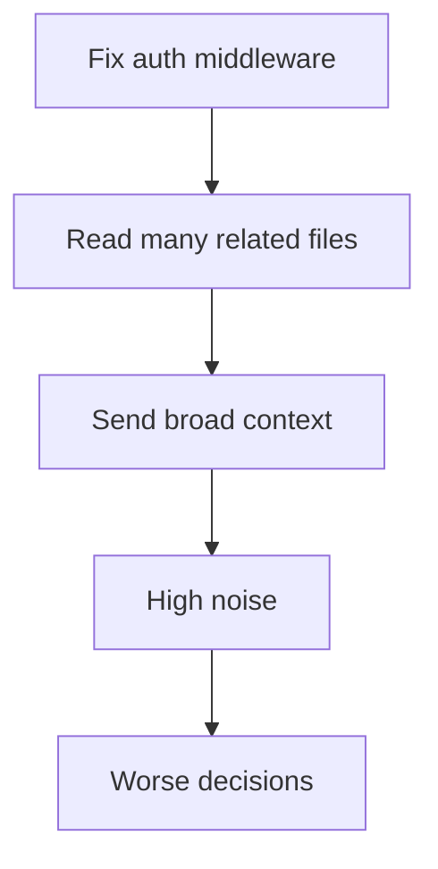
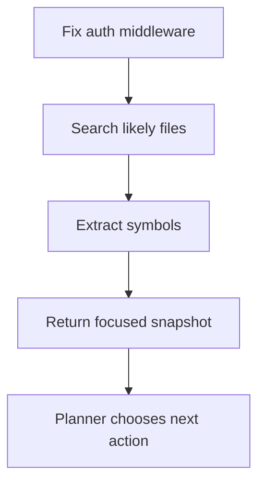
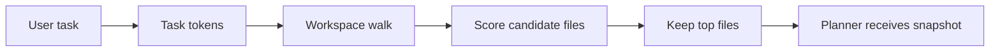
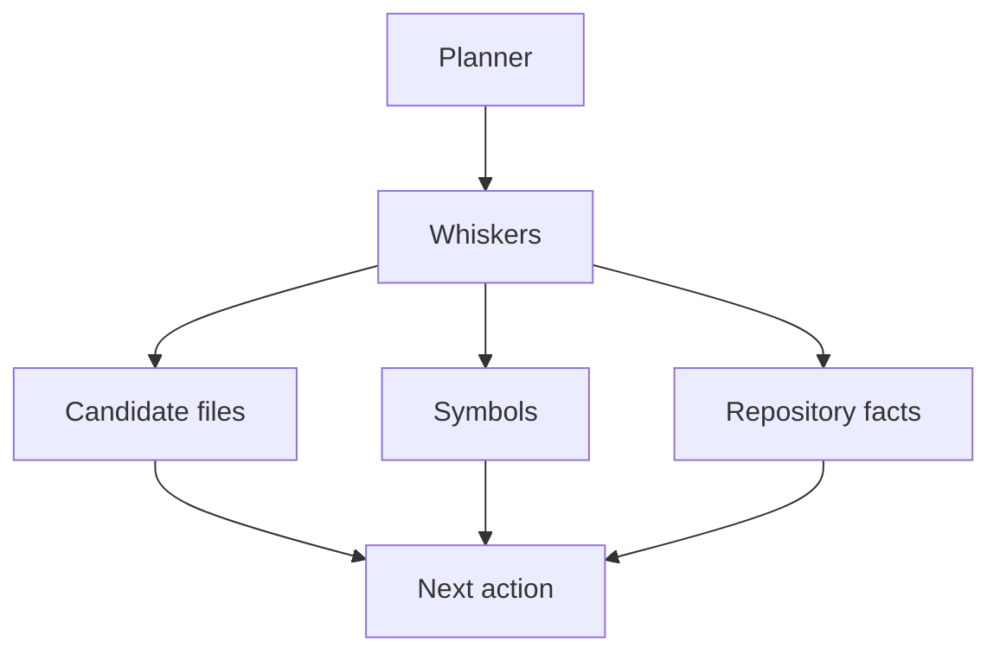

# What a Coding Agent Actually Reads

Article 1 defined the architecture. Article 2 is where it starts doing real work.

When we first wired up a naive context pass — just grab files with "auth" in the name, throw them at the model, see what happens — the agent gave confident, plausible, wrong answers. Not because the model was bad. Because we handed it forty files when it needed three functions. The noise won.

That's the problem this article solves. A coding agent doesn't get better by reading more code. It gets better by reading less of the right code. The difference between a wrapper and a real agent is mostly this: the wrapper guesses and floods, the agent narrows and extracts.

This is the code-reading layer for projectKitty, what we call **Whiskers**. Its job:

- find the right files quickly
- extract the most relevant symbols
- return focused context to the planner
- protect the model from repository noise

Let's build it.

---

## 1. Raw File Reading Is Just Expensive Guessing

If a user says "fix the auth middleware" and the agent responds by reading every file with `auth` in the name, every router file, every config file, and the README just in case — that's not intelligence. That's a keyword search with a token bill.

The model burns budget on code that's adjacent to the task but irrelevant to it. The planner gets weaker signals. The whole loop slows down before it's even started.



The system didn't fail at reasoning. It failed at narrowing. Fix that first.



The quality of every downstream decision depends on this step. Get it wrong and you're making mistakes faster.

---

## 2. Code Reading Is a Retrieval Problem

Before the agent can reason well it needs to answer a smaller set of practical questions:

- which files are probably relevant
- which functions or types live inside them
- which small region should be shown next
- what can be safely ignored for now

That's a retrieval problem. Not vector search, not semantic magic — a disciplined local pipeline that converts a vague task into a short list of likely code locations.

For the first useful version, that pipeline is:

1. tokenize the task
2. search the repository cheaply
3. score files by filename and content matches
4. run an outline pass over likely files
5. return a compact snapshot

That's already enough to make Whiskers behave very differently from a plain file dump.

---

## 3. Search Before You Parse — Most Files Don't Make the Cut

One mistake we see in agent design is parsing everything up front. Full repository indexing before the first action sounds thorough. In practice it's the wrong tradeoff for most tasks — slow to build, expensive to maintain, and unnecessary when you just need to eliminate 90% of the repo in under a second.

So the first stage in Whiskers is deliberately cheap:

- skip obvious junk: `.git`, `node_modules`, internal agent state
- ignore large files unlikely to matter for the current question
- prefer a fast search pass first and fall back to a full walk when needed
- score candidates against task tokens in the path and content
- keep only the top few files



This is what Whiskers does now. It tries a cheap `ripgrep`-style search pass first, falls back to a workspace walk if that is unavailable, filters noise, scores candidates, and hands the planner a short list. Not glamorous. Reliably useful.

---

## 4. Symbol Extraction: Don't Hand Over the Whole File

Candidate files are not enough. Handing full files to the planner is the same problem one level down — more content than needed, more noise than signal.

The next filter is symbol extraction.

Even a lightweight pass gives the planner far better signals:

- does this file actually define the middleware or just import it
- is the target a `func`, a `type`, an interface
- which file looks like implementation and which looks like wiring

In Whiskers' current implementation, symbol extraction is syntax-aware for Go files. It uses Go's AST to build an outline of top-level declarations and methods, then falls back to regex extraction for simpler cases. So instead of receiving a blind file path, the planner gets:

- `internal/auth/middleware.go`
- symbols: `AuthMiddleware`, `SessionManager`, `SessionManager.Validate`

That small upgrade changes the next action from "maybe read the whole file" to "read this specific symbol." One focused read instead of a fishing expedition.

---

## 5. Don't Let the Intelligence Layer Become a Second Planner

Here's a boundary worth defending: if Whiskers gets too clever, it starts making decisions that belong to the planner. That's the wrong split.

The planner decides what to do next. Whiskers answers narrow repository questions quickly and predictably. That's it.

So the interface stays small:

- accept a task and workspace
- return candidate files
- return extracted symbols
- summarize what was found
- expose basic repository facts

That's exactly how projectKitty's `Scan` interface is shaped. It returns a `ContextSnapshot`: candidate files, symbol lists, a summary string, basic project signals like whether a Go module exists, and only a focused symbol when the match is actually strong enough. It does not try to solve the task. It hands the planner a clear picture and gets out of the way.



Keeping this boundary clean means the subsystem stays testable, composable, and replaceable. The moment Whiskers starts reasoning about what the user probably wants, you've got two planners arguing with each other.

---

## 6. Where Regex Breaks and Tree-sitter Takes Over

The current implementation is a solid first slice and still deliberately limited. Syntax-aware Go outlines plus regex fallback work well for:

- fast repository narrowing
- top-level Go declarations and methods
- early-stage implementations where speed matters more than precision

But real repositories still break it. Multi-language codebases, language-specific syntax, cross-file relationships, and truly precise semantic extraction all push past what a Go-only AST pass can do.

Tree-sitter is the upgrade path. It lets Whiskers ask structural questions instead of string questions:

- give me the function node for this symbol
- show only the method body
- identify the enclosing class or interface
- extract a syntactic block with exact line boundaries

This is why agents like Claude Code ship syntax-aware reading infrastructure. Once you need reliable code selection at the symbol level, parsing stops being an optimization and becomes part of the architecture.

The progression in projectKitty is intentional:

1. fast local narrowing
2. syntax-aware extraction where the runtime already has a parser
3. Tree-sitter for cross-language symbol reads
4. symbol-level reads as typed tools

We don't need the perfect parser to ship a useful subsystem. We do need to leave the door open for it.

---

## 7. Focused Context Is Budget Control

The easiest mistake in AI tooling is assuming better results come from more data. More files, broader context, longer prompts. It feels thorough. It usually isn't.

The agent gets stronger when:

- retrieved files are fewer
- selected regions are smaller
- symbols are more precisely identified
- the planner sees less code it doesn't need

Whiskers exists to protect this budget. Every unnecessary file it keeps is tokens the planner can't use for reasoning. Every symbol it misses is an action that starts with the wrong assumptions.

Focused context isn't aesthetic. It's how the loop stays fast and the decisions stay sharp.

---

## 8. What Whiskers Does Now

By the end of this article, projectKitty has a working code-intelligence subsystem with a clear job:

- tokenize the task into search terms
- search the workspace cheaply and fall back safely
- rank candidate files
- build a symbol outline for likely files
- read a focused symbol only when the match is strong enough
- hand the planner a focused snapshot

The loop goes from:

```text
user request → model guesses → broad file reads → noise
```

to:

```text
user request → Whiskers scans → likely files and symbols → planner acts
```

That's a real upgrade. The architecture is doing useful work.

---

## 9. Context Has to Come Before Execution

The series order matters.

Before we let projectKitty run commands, edit files, or manage long sessions, it needs to see the codebase clearly enough to choose sensible actions. Skip this step and execution just makes bad decisions faster — confidently, repeatedly, at scale.

Craftydraft didn't have this problem because it never acted on anything. projectKitty will. Whiskers is what keeps that from becoming dangerous.

---

## What's Next?

Article 3 moves from reading to acting.

That means building a runtime that executes commands safely, handles interactive terminal behavior correctly, streams output as it arrives, and enforces policy boundaries around operations that can't be undone.

Whiskers can now narrow a repository. Next we build the Claws to act inside one — without becoming reckless.

---

Article 2 is live. Implementation in progress: [github.com/w1ne/ProjectKitty](https://github.com/w1ne/ProjectKitty)

Follow Entropora, Inc for Article 3.
