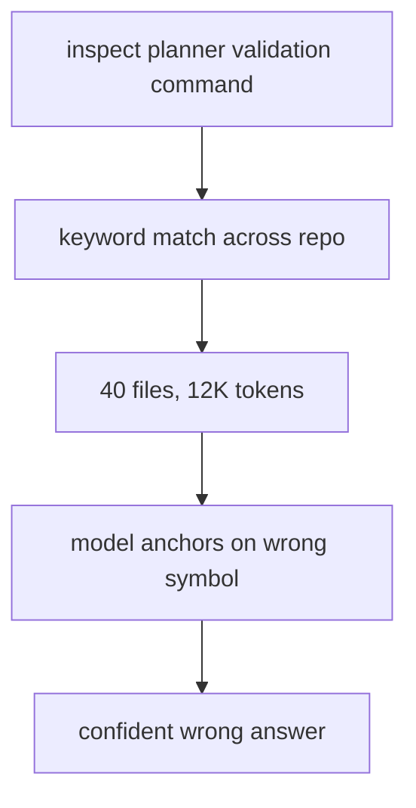
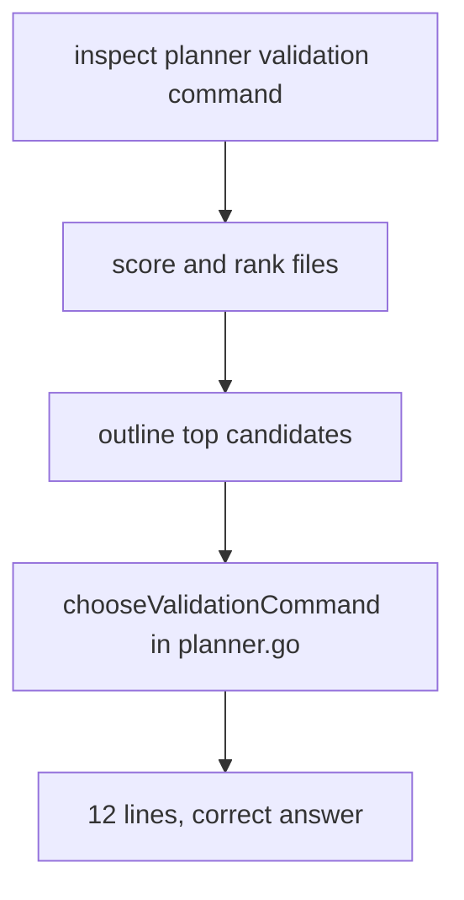
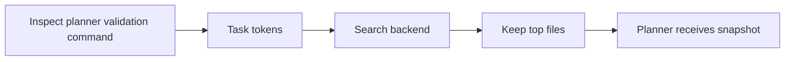
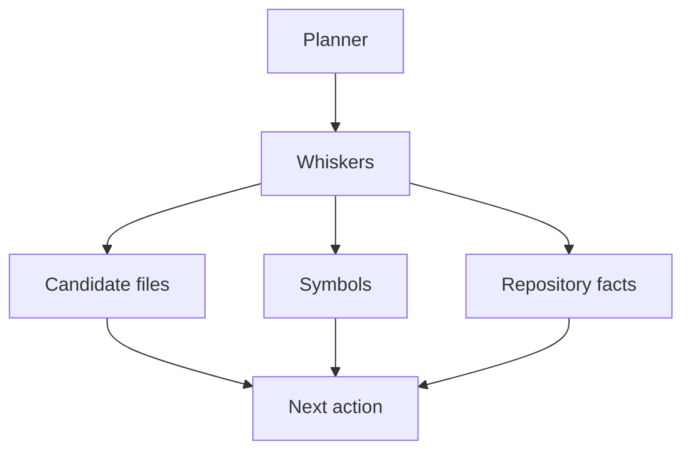

# What a Coding Agent Actually Reads

Task: *inspect the planner validation command*.

A naive agent searches for `validate`, `run`, `test`, `plan` — anything that sounds related. It finds `planner.go`, `agent.go`, `agent_test.go`, `planner_test.go`, the README, and a few stray notes. All of them mention those words somewhere. The agent sends all of it to the model.

The model reads everything and returns a confident, detailed answer. Wrong function. Wrong file. It described `ActionRunCommand` in the agent loop when the actual question was about `chooseValidationCommand` in the planner — twelve lines that pick `go test ./...` or `git status --short`. The model never saw it because it was buried under forty files of noise.

That's not a model failure. Given the context it received, the model did fine. The failure was earlier: we let the agent read too much.

This article is about fixing that. A coding agent doesn't get better by reading more code. It gets better by reading less of the right code. The difference between a wrapper and a real agent is mostly this: the wrapper guesses and floods, the agent narrows and extracts.

This is the code-reading layer for projectKitty, what we call **Whiskers**. Its job:

- find the right files quickly
- extract the most relevant symbols
- return focused context to the planner
- protect the model from repository noise

---

## 1. The Actual Problem: Wrong Files, Confident Answers

Here's what the naive version did, step by step, on that same task:

1. Tokenize "inspect the planner validation command" → `["planner", "validation", "command"]`
2. Search every file containing any of those tokens
3. Get back: `planner.go`, `agent.go`, `agent_test.go`, `planner_test.go`, `README.md`, `ARTICLE_1.md`
4. Send all of it to the model as context

The model anchored on `agent.go` because it's the largest file and contains the most token matches. It found `ActionRunCommand` — which *does* run commands — and answered confidently about that. But `chooseValidationCommand` in `planner.go` is the actual function being asked about. Never got shown.

The system didn't fail at reasoning. It failed at narrowing. Fix that first.



The right behavior:



The quality of every downstream decision depends on this step. Get it wrong and you're making mistakes faster.

---

## 2. Code Reading Is a Retrieval Problem

Before the agent can reason well it needs to answer a smaller set of practical questions:

- which files are probably relevant
- which functions or types live inside them
- which small region should be shown next
- what can be safely ignored for now

That's a retrieval problem. Not vector search, not semantic magic — a disciplined local pipeline that converts a vague task into a short list of likely code locations.

For the current useful version, that pipeline is:

1. tokenize the task
2. run a cheap first search pass (ripgrep-style)
3. run a refined structural search pass using names from the first slice
4. rank files by filename content, and fuzzy path scoring
5. run an outline pass over likely files — symbol snippets capped at 20 lines
6. trace a few nearby related files around the strongest symbol
7. optionally read one focused symbol when the match is strong enough
8. outline the related files for one cross-file hop
9. emit `context_window_will_overflow` if estimated token cost exceeds 40K
10. emit `loop_detected` and stop if the session exceeds the turn limit

That's already enough to make Whiskers behave very differently from a plain file dump.

---

## 3. Search Before You Parse — Most Files Don't Make the Cut

One mistake we see in agent design is parsing everything up front. Full repository indexing before the first action sounds thorough. In practice it's the wrong tradeoff for most tasks — slow to build, expensive to maintain, and unnecessary when you just need to eliminate 90% of the repo in under a second.

So the first stage in Whiskers is deliberately cheap:

- respect repository ignore rules and standard tool filtering before deeper reads
- ignore large files unlikely to matter for the current question
- prefer a fast search pass first and fall back to a full walk when needed
- score candidates against task tokens in the path and content
- keep only the top few files



This is what Whiskers does now. It tries a cheap `ripgrep`-style search pass first, then does a refined structural pass using names it discovered in the first slice, then falls back to Git-aware file discovery or a generic workspace walk when needed. The important part is not just the fallback order. Whiskers also reports which search backend it used and how many passes ran, so the loop is more inspectable instead of hiding retrieval behind one vague "context" step. That keeps the retrieval layer closer to the pattern we actually saw in the research: generic file tools plus ignore-aware filtering, not product-specific path exclusions buried in the core reader.

---

## 4. Symbol Extraction: Don't Hand Over the Whole File

Candidate files are not enough. Handing full files to the planner is the same problem one level down — more content than needed, more noise than signal.

The next filter is symbol extraction.

Even a lightweight pass gives the planner far better signals:

- does this file actually choose the validation command or just mention testing
- is the target a `func`, a `type`, an interface
- which file looks like implementation and which looks like wiring

In Whiskers' current implementation, symbol extraction is syntax-aware across the languages we care about first: Go, Java, JavaScript, TypeScript, Python, Rust, Ruby, Bash, C, C++, C#, PHP, and Scala — with HTML, JSON, and CSS also parsed structurally. Under the hood it uses a single Tree-sitter-backed reader with per-language grammars, then falls back to regex extraction only for unsupported files. So instead of receiving a blind file path, the planner gets:

- `internal/agent/planner.go`
- symbols: `chooseValidationCommand`, `NewPlanner`, `DefaultPlanner.Next`

That small upgrade changes the next action from "maybe read the whole file" to "read this specific symbol." One focused read instead of a fishing expedition.

Whiskers now also does one small but important thing beyond pure ranking: once it has a strong symbol match, it traces a few nearby related files that reference the same symbol. That is not deep call-graph analysis yet, but it gives the planner a better local neighborhood around the main target.

Just as important, Whiskers now refuses weak matches. If the outline stage cannot produce a strong structural hit, it says so and stops there. That's a real behavior improvement over the typical agent failure mode of reading something nearby and acting confident about it.

Three things Whiskers does now that most wrappers skip:

**Snippet truncation.** Symbol snippets are capped at 20 lines — signature plus enough body to be useful, not the whole function. This is budget control at the extraction layer. Full bodies can be thousands of tokens; Whiskers doesn't send them.

**Fuzzy path scoring.** Alongside exact content search, Whiskers uses character-subsequence matching on file paths — the same style as Codex's fuzzy file search. This catches files when task terms appear in path segments but not in file content, or when spelling varies.

**Context window estimation.** After outlining, Whiskers estimates the token cost of the candidate context (file content / 4). If the estimate exceeds 40K tokens, it emits a `context_window_will_overflow` event — matching Gemini's named overflow state — so the planner and UI can respond before hitting a hard model limit.

---

## 5. Don't Let the Intelligence Layer Become a Second Planner

Here's a boundary worth defending: if Whiskers gets too clever, it starts making decisions that belong to the planner. That's the wrong split.

The planner decides what to do next. Whiskers answers narrow repository questions quickly and predictably. That's it.

So the interface stays small:

- accept a task and workspace
- return candidate files
- return extracted symbols
- summarize what was found
- expose basic repository facts

That's exactly how projectKitty's `Scan` interface is shaped. It returns a `ContextSnapshot`: candidate files, symbol lists, a summary string, related files around the strongest match, basic project signals like whether a Go module exists, and only a focused symbol when the match is actually strong enough. It does not try to solve the task. It hands the planner a clear picture and gets out of the way.

In the current repo, that looks like this:

```text
[observed] Search results: Focused context narrowed to 5 files via ripgrep (2 passes): internal/agent/planner.go, internal/agent/agent.go, cmd/projectkitty/main.go, internal/agent/types.go, internal/intelligence/service.go
[observed] Outline results: Outlined 5 candidate files. Related files: internal/agent/agent.go, cmd/projectkitty/main.go. Best symbol match: chooseValidationCommand in internal/agent/planner.go.
[observed] Focused symbol: Read symbol chooseValidationCommand from internal/agent/planner.go.
```

That is a much more useful planner input than "here are ten files that contain the word test."



Keeping this boundary clean means the subsystem stays testable, composable, and replaceable. The moment Whiskers starts reasoning about what the user probably wants, you've got two planners arguing with each other.

---

## 6. One Interface, One Structural Reader

The important design choice is not "write a custom parser for every language." That's exactly the kind of implementation that turns an agent into a maintenance burden.

Instead, Whiskers keeps one interface:

- `Search`
- `Outline`
- `Read symbol`

and one structural reading engine underneath it.

That matters because the clean tool shape stays stable while the internals get better. The planner does not care whether the file is Go, TypeScript, Python, or Bash. It asks the same question each time: what files matter, what symbols are inside them, and which symbol should I read next?

Today that structural reader is Tree-sitter-backed for the supported languages and regex-backed for the fallback path. That split gives us a useful universal tool without pretending every language is solved equally well.

This is also where Whiskers now lines up much better with the coding-agent patterns we studied:

- Claude research strongly supports syntax-aware code reading as the right direction. Our reverse-engineering points to structural code selection and language-aware parsing, so Whiskers' move toward syntax-aware symbol extraction is evidence-backed.
- Codex research strongly supports cleaner explicit tool boundaries. The main lesson there is not a specific parser, but a cleaner split between "find things" and "read things." Whiskers' `Search` / `Outline` / `Read symbol` shape follows that pattern, and the agent state now models those as explicit typed tool stages rather than raw blobs.
- Gemini research strongly supports observable staged execution. Gemini exposes a typed event stream with named turn states. Whiskers is closer to that style than before because its stages are now explicit, but it is not yet equivalent to Gemini's typed state-machine design.

Those comparisons matter, but they should be read carefully. They are not claims that projectKitty has reached Claude, Codex, or Gemini implementation depth. They are narrower claims:

- the Claude comparison is about syntax-aware reading depth
- the Codex comparison is about clean tool boundaries
- the Gemini comparison is about observable staged execution

That does not make the subsystem equivalent to any of them. It makes the current design direction defensible against the research we actually have.

There is still a fallback path, and unsupported languages still degrade to regex. But the important architectural jump is already here: the public behavior is universal even when the internals still have room to grow.

And because `Read symbol` now uses the same structural extractor as `Outline`, the final read step is consistent with the ranking step. We are no longer outlining one way and reading another.

---

## 7. Focused Context Is Budget Control

The easiest mistake in AI tooling is assuming better results come from more data. More files, broader context, longer prompts. It feels thorough. It usually isn't.

The agent gets stronger when:

- retrieved files are fewer
- selected regions are smaller
- symbols are more precisely identified
- the planner sees less code it doesn't need

Whiskers exists to protect this budget. Every unnecessary file it keeps is tokens the planner can't use for reasoning. Every symbol it misses is an action that starts with the wrong assumptions.

The filtering is also cheap. Benchmarks on the current implementation show fuzzy path scoring at ~36 ns per call with zero allocations, symbol outlining at ~839 µs for a two-file candidate set, and a full search pass at ~8 ms including file I/O. Budget control doesn't cost much to enforce — the overhead of narrowing is far smaller than the cost of not narrowing.

Focused context isn't aesthetic. It's how the loop stays fast and the decisions stay sharp.

---

## 8. What Whiskers Does Now

By the end of this article, projectKitty has a working code-intelligence subsystem with a clear job:

- tokenize the task into search terms
- search the workspace cheaply and fall back safely, with fuzzy path scoring as a secondary signal
- rank candidate files
- run a structural refinement pass before final ranking
- build a syntax-aware symbol outline for likely files, with snippets capped at 20 lines
- trace a few nearby related files for the strongest symbol
- read a focused symbol only when the match is strong enough
- outline the related files after reading the focused symbol for one cross-file hop
- emit `context_window_will_overflow` if estimated token cost exceeds threshold
- emit `loop_detected` and stop if the session exceeds the turn limit
- return `No strong symbol match yet` when the repo does not justify a focused read
- hand the planner a focused snapshot

The loop goes from:

```text
user request → model guesses → broad file reads → noise
```

to:

```text
inspect planner validation command
  → Search: planner.go, agent.go, types.go (2 passes via ripgrep)
  → Outline: chooseValidationCommand in planner.go
  → ReadSymbol: chooseValidationCommand
  → OutlineRelated: agent.go, types.go (cross-file hop)
  → planner acts
```

That's a real upgrade. The architecture is doing useful work.

---

## 9. Context Has to Come Before Execution

The series order matters.

Before we let projectKitty run commands, edit files, or manage long sessions, it needs to see the codebase clearly enough to choose sensible actions. Skip this step and execution just makes bad decisions faster — confidently, repeatedly, at scale.

Craftydraft didn't have this problem because it never acted on anything. projectKitty will. Whiskers is what keeps that from becoming dangerous.

---

## 10. Current Weaknesses

Article 2 is useful, but it is not complete. The important weaknesses are clear:

- ranking is still mostly lexical and structural, not deeply semantic
- cross-file reasoning is one hop: after reading the focused symbol, Whiskers outlines the related files to get their symbols — but still does not trace call graphs or data flow across multiple levels
- less common languages still fall back to regex extraction; popular languages are now covered by Tree-sitter
- tree-sitter coverage for constructs within already-supported languages — interface fields, anonymous functions, decorators — is still incomplete
- the tool surface is cleaner now, but still not as explicitly separated and reusable as a more mature Codex-style architecture
- syntax-aware extraction is good enough for this slice, but still not the same thing as full semantic understanding

Four weaknesses that were listed here are now addressed: token estimation uses a per-extension heuristic (code files at bytes/3, prose at bytes/5, default at bytes/4) instead of a uniform bytes/4; `Scan` now performs an adaptive broadened retry when the first outline pass finds no focused symbol; the planner-driven agent loop now does the same — when the outline stage finds no strong match, the planner emits `ActionBroadenSearch`, the agent re-runs search on the single longest task token, merges the expanded candidate list, and re-outlines with a `BroadenedSearch` guard to prevent infinite retries; and the generic walk fallback now skips common dependency and build directories (`vendor`, `node_modules`, `target`, `dist`, `__pycache__`, and others) that ripgrep and git ls-files already exclude via `.gitignore` — closing the gap between the walk backend and the primary backends.

Those are not reasons to discard the subsystem. They are the reasons later articles still matter.

The practical follow-up list is straightforward:

- improve ranking with stronger structural evidence
- add richer code relationship tracing, beyond the current single hop
- expand Tree-sitter symbol extraction to additional constructs within already-supported languages (interface fields, anonymous functions, decorators)
- keep tightening the tool and event boundaries around the subsystem

That is the path from a useful code-reading layer to a much stronger one.

---

## What's Next?

Article 3 moves from reading to acting.

That means building a runtime that executes commands safely, handles interactive terminal behavior correctly, streams output as it arrives, and enforces policy boundaries around operations that can't be undone.

Whiskers can now narrow a repository. Next we build the Claws to act inside one — without becoming reckless.

---

Article 2 is live. Implementation in progress: [github.com/w1ne/ProjectKitty](https://github.com/w1ne/ProjectKitty)

Follow Entropora, Inc for Article 3.
